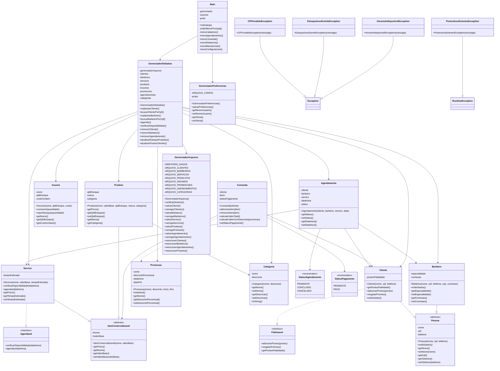

```mermaid
classDiagram

    class Pessoa {
        <<abstract>>
        -nome
        -cpf
        -telefone
        +Pessoa(nome, cpf, telefone)
        +exibirDados()* 
        +getNome() 
        +setNome(nome)
        +getCpf() 
        +getTelefone() 
        +setTelefone(telefone)
    }

    class ItemComercializavel {
        <<abstract>>
        #nome
        #valorBase
        +ItemComercializavel(nome, valorBase)
        +getPreco()* 
        +getNome() 
        +getValorBase() 
        +setValorBase(valorBase)
    }

    class Agendavel {
        <<interface>>
        +verificarDisponibilidade(dataHora)
        +agendar(dataHora)
    }

    class Fidelizavel {
        <<interface>>
        +adicionarPontos(pontos)
        +resgatarPremios()
        +getPontosFidelidade()
    }

    class Cliente {
        -pontosFidelidade
        +Cliente(nome, cpf, telefone)
        +getPontosFidelidade()
        +adicionarPontos(pontos)
        +resgatarPremios()
        +exibirDados()
    }

    class Barbeiro {
        -especialidade
        -comissao
        +Barbeiro(nome, cpf, telefone, esp, comissao)
        +exibirDados()
        +getEspecialidade()
        +setEspecialidade()
        +getComissao()
        +setComissao()
    }

    class Servico {
        -tempoEstimado
        +Servico(nome, valorBase, tempoEstimado)
        +verificarDisponibilidade(dataHora)
        +agendar(dataHora)
        +getPreco()
        +getTempoEstimado()
        +setTempoEstimado()
    }

    class Produto {
        -qtdEstoque
        -marca
        -categoria
        +Produto(nome, valorBase, qtdEstoque, marca, categoria)
        +getPreco()
        +getQtdEstoque()
        +setQtdEstoque()
        +getMarca()
        +getCategoria()
    }

    class Insumo {
        -nome
        -qtdEstoque
        -custoUnitario
        +Insumo(nome, qtdEstoque, custo)
        +consumir(quantidade)
        +reporEstoque(quantidade)
        +getNome()
        +getQtdEstoque()
        +getCustoUnitario()
    }

    class Promocao {
        -nome
        -descontoPercentual
        -dataInicio
        -dataFim
        +Promocao(nome, desconto, inicio, fim)
        +estaAtiva()
        +getNome()
        +getDescontoPercentual()
        +setDescontoPercentual()
    }
    
    class Categoria {
        -nome
        -descricao
        +Categoria(nome, descricao)
        +getNome()
        +setNome()
        +getDescricao()
        +setDescricao()
        +toString()
    }

    class Agendamento {
        -cliente
        -barbeiro
        -servico
        -dataHora
        -status
        +Agendamento(cliente, barbeiro, servico, data)
        +getStatus()
        +setStatus()
        +getDataHora()
        +setDataHora()
    }

    class Comanda {
        -cliente
        -itens
        -statusPagamento
        +Comanda(cliente)
        +adicionarItem(item)
        +removerItem(item)
        +calcularValorTotal()
        +calcularValorComDesconto(promocao)
        +setStatusPagamento()
    }

    class StatusAgendamento {
        <<enumeration>>
        PENDENTE
        CONCLUIDO
        CANCELADO
    }

    class StatusPagamento {
        <<enumeration>>
        PENDENTE
        PAGO
    }

    class GerenciadorArquivos {
        -DIRETORIO_DADOS
        -ARQUIVO_CLIENTES
        -ARQUIVO_BARBEIROS
        -ARQUIVO_SERVICOS
        -ARQUIVO_PRODUTOS
        -ARQUIVO_INSUMOS
        -ARQUIVO_PROMOCOES
        -ARQUIVO_AGENDAMENTOS
        -ARQUIVO_CATEGORIAS
        +GerenciadorArquivos()
        +verificarDiretorio()
        +salvarCliente()
        +carregarClientes()
        +salvarBarbeiro()
        +carregarBarbeiros()
        +salvarServico()
        +carregaServicos()
        +salvarProdutos()
        +carregaProdutos()
        +salvarAgendamento()
        +carregarAgendamentos()
        +reescreverClientes()
        +reescreverBarbeiros()
        +reescreverAgendamentos()
        +reescreverProdutos()
    }

    class GerenciadorDeDados {
        -gerenciadorArquivos
        -clientes
        -barbeiros
        -servicos
        -produtos
        -insumos
        -promocoes
        -agendamentos
        -categorias
        +GerenciadorDeDados()
        +cadastrarCliente()
        +buscarClientePorCpf()
        +cadastrarBarbeiro()
        +buscarBarbeiroPorCpf()
        +agendar()
        +verificarDisponibilidade()
        +removerCliente()
        +removerBarbeiro()
        +removerAgendamento()
        +atualizarEstoqueProdutos()
        +atualizarPontosClientes()
    }

    class GerenciadorPreferencias {
        -ARQUIVO_CONFIG
        -props
        +GerenciadorPreferencias()
        +salvarPreferencias()
        +getNomeUsuario()
        +setNomeUsuario()
        +getTema()
        +setTema()
    }

    class CPFInvalidoException {
        +CPFInvalidoException(message)
    }

    class EstoqueInsuficienteException {
        +EstoqueInsuficienteException(message)
    }

    class HorarioIndisponivelException {
        +HorarioIndisponivelException(message)
    }

    class PontosInsuficientesException {
        +PontosInsuficientesException(message)
    }

    class Main {
        -gerenciador
        -scanner
        -prefs
        +main(args)
        -exibirMenuPrincipal()
        -menuCadastros()
        -menuAgendamentos()
        -menuComanda()
        -menuRelatorios()
        -menuManutencao()
        -menuConfiguracoes()
    }

    %% Heranças
    Cliente --|> Pessoa
    Barbeiro --|> Pessoa
    Cliente ..|> Fidelizavel
    Servico --|> ItemComercializavel
    Produto --|> ItemComercializavel
    Servico ..|> Agendavel

    %% Associações
    Produto --> Categoria
    Agendamento --> Cliente
    Agendamento --> Barbeiro
    Agendamento --> Servico
    Agendamento --> StatusAgendamento

    Comanda --> Cliente
    Comanda --> ItemComercializavel
    Comanda --> StatusPagamento
    Comanda ..> Promocao

    GerenciadorDeDados --> GerenciadorArquivos
    GerenciadorDeDados --> Cliente
    GerenciadorDeDados --> Barbeiro
    GerenciadorDeDados --> Servico
    GerenciadorDeDados --> Produto
    GerenciadorDeDados --> Insumo
    GerenciadorDeDados --> Promocao
    GerenciadorDeDados --> Agendamento
    GerenciadorDeDados --> Categoria

    Main --> GerenciadorDeDados
    Main --> GerenciadorPreferencias

    CPFInvalidoException --|> Exception
    EstoqueInsuficienteException --|> Exception
    HorarioIndisponivelException --|> Exception
    PontosInsuficientesException --|> RuntimeException
```
